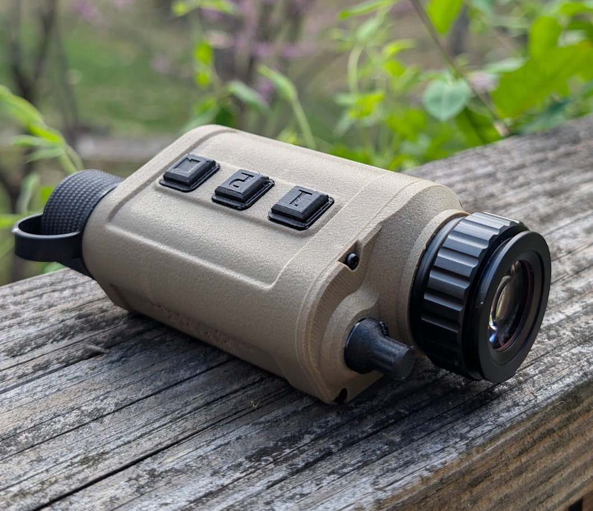
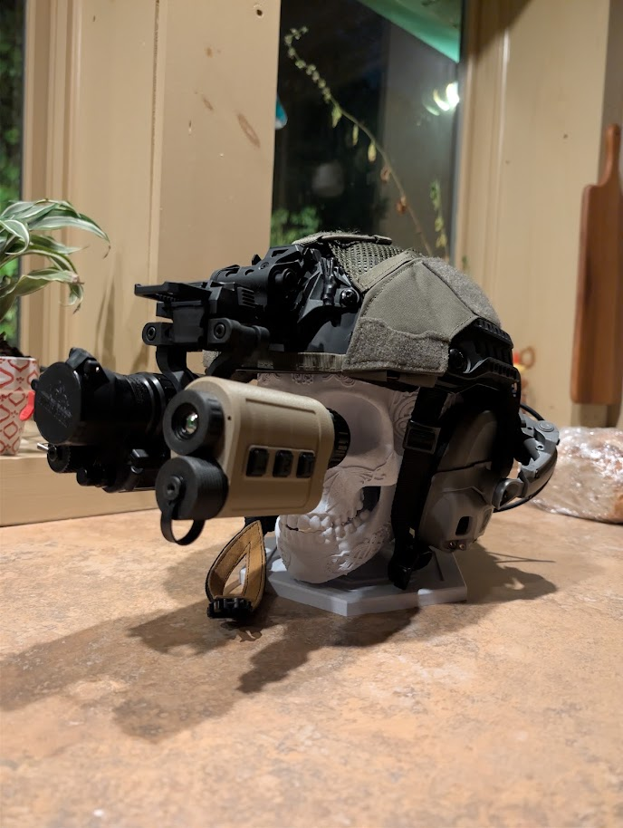
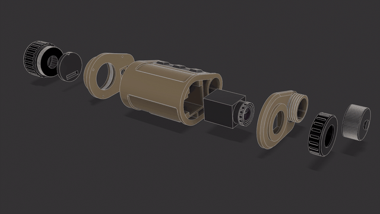
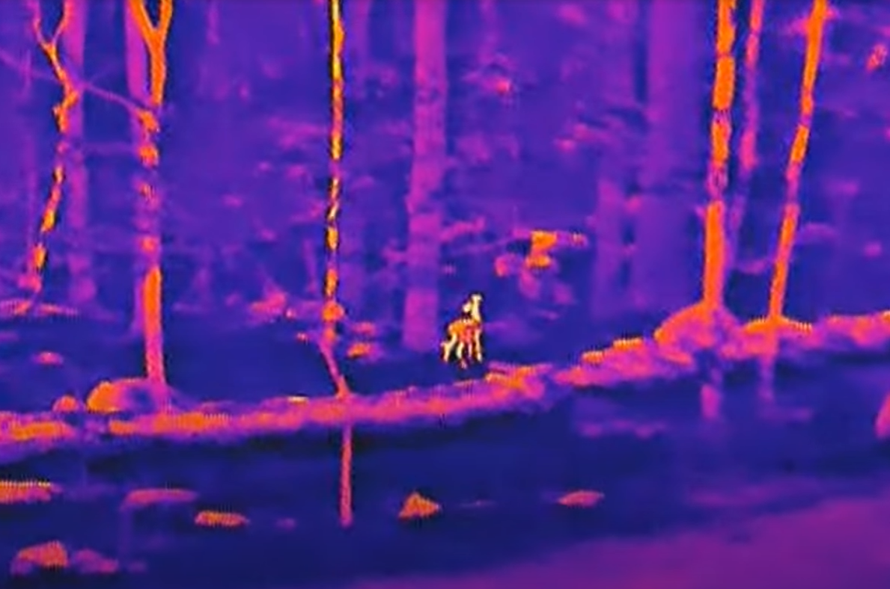
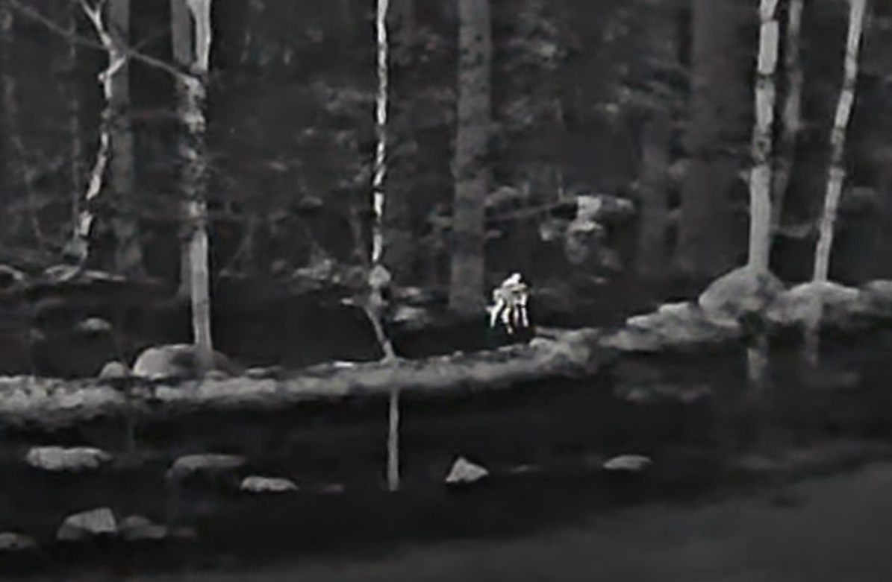
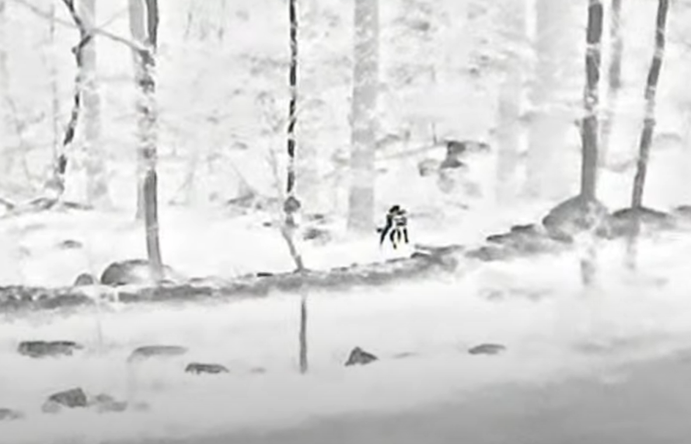
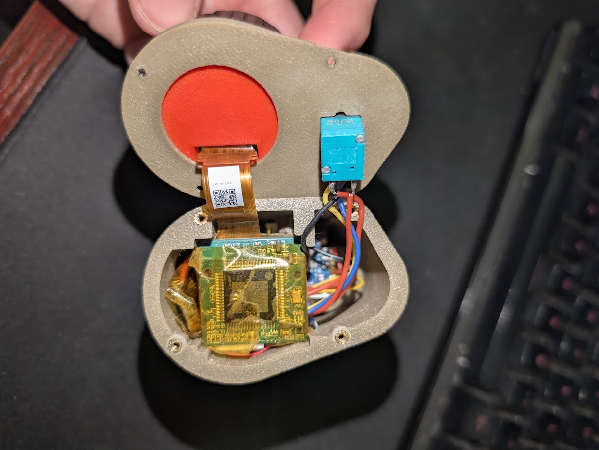

# PV-13 Thermal Imaging Monocular

A DIY, helmet-mountable thermal imaging monocular built around the **HDANIEE P6-UC** thermal core, a custom 3D-printed housing, and an ESP32 controller for camera control (zoom, palette, brightness/contrast, NUC).

PV-13 has its own 3D-printed housing (`models/`) and its own ESP32 firmware (`code/`).

<p align="center">
  
  
</p>

## Demo

<p align="center">
  
</p>

<p align="center">
  
  
  
</p>

## Features

- HDANIEE P6-UC thermal core, 640x512, 12µm
- Digital zoom (4 steps: 10x / 13x / 20x / 40x)
- 4 color palettes: white hot, black hot, green hot, iron red
- Manual NUC (shutterless calibration) via button hold
- Analog brightness/contrast control via rotary potentiometer
- 3D-printed housing sized for helmet rail mounting
- ~1.5 hour runtime on an 18350 cell

## Bill of Materials

| Component | Notes | Qty | Approx. Price | Source |
|---|---|---|---|---|
| HDANIEE P6-UC thermal core | 640x512, 12µm — see `docs/` for datasheets | 1 | $420 | [hdaniee.com](https://www.hdaniee.com/p6-uc-series.html) |
| 0.39" OLED display | Display + driver board | 1 | $110 | AliExpress |
| NP18 lens | Optics for the thermal core | 1 | $60 | AliExpress |
| ESP32-C3 | Main controller | 1 | $1 | AliExpress |
| 5V boost converter | Battery to 5V | 1 | $2 | Amazon |
| 18350 battery | Power source | 1 | $15 | Amazon |
| Battery contacts | Spring terminals | 1 | $5 | Amazon |
| Rotary potentiometer (20k) | Brightness/contrast control | 1 | $2 | AliExpress |
| Momentary buttons | Zoom/Mode + NUC/Palette | 2 | $2 | AliExpress |
| Runcam DVR *(optional)* | Recording module | 1 | $30 | AliExpress |
| MicroSD extender *(optional, needed for DVR)* | | 1 | $10 | Amazon |
| M2.5 x 6 bolts | Housing fasteners | — | $2 | Amazon |
| Heat-set inserts | Threaded inserts for housing | — | $10 | Amazon |
| Silicone wire | Internal wiring | — | $6 | Amazon |

**Estimated cost:** ~$635 (~$675 with the DVR add-on)

> This build uses 2 physical buttons (not 3) — see [Controls](#controls) below for how zoom, palette, and NUC are consolidated onto BTN1/BTN2 plus the pot.

## Repository Structure

```
PV-13/
├── models/    3D-printable housing parts (.stl)
├── code/      ESP32 firmware
├── docs/      P6-UC datasheets / specifications
├── images/    Build photos and thermal sample captures
└── LICENSE
```

## 3D-Printed Parts

All housing parts are in [`models/`](models/), printed in PETG or ABS for heat resistance near the thermal core:

| File | Part |
|---|---|
| `main-body.stl` | Main housing / electronics bay |
| `ocular_housing.stl` | Eyepiece housing |
| `OLED_mount.stl` | Display mount |
| `focus_adjuster.stl` | Lens focus ring |
| `rotary_cover.stl` | Potentiometer knob cover |
| `buttons.stl` | Button caps |
| `battery_cap.stl` | 18350 battery compartment cap |

Assemble with M2.5 x 6 bolts into heat-set inserts pressed into the printed housing.

<p align="center">
  
</p>

## Electronics & Wiring

The ESP32 talks to the P6 core over UART using its serial command protocol, reads the potentiometer over ADC, and debounces two buttons on GPIO inputs.

| Signal | ESP32 Pin | Connects to |
|---|---|---|
| UART TX | GPIO1 | P6 core RX |
| UART RX | GPIO2 | P6 core TX |
| Potentiometer wiper | GPIO4 (ADC) | Brightness/contrast pot |
| Button 1 (zoom/brightness) | GPIO5 | Momentary button → GND (internal pull-up) |
| Button 2 (palette/NUC/contrast) | GPIO6 | Momentary button → GND (internal pull-up) |

UART runs at 115200 8N1. Commands are framed as 13-byte packets (`0x55` header, cmd1, cmd2, 8 data bytes, checksum, `0xAA` footer) per the P6 serial protocol — see [`docs/`](docs/) for the full command reference.

## Firmware

Source: [`code/PV13_firmware.cpp`](code/PV13_firmware.cpp)

On boot, the ESP32 waits ~3 seconds for the P6 core to come up, then pushes a default configuration (auto-correction on, white-hot palette, 13x zoom, brightness 70, contrast 64, denoise 40, enhancement 80) and saves it to the core.

### Controls

**Button 1 — zoom / brightness**
- Press: cycle zoom (10x → 13x → 20x → 40x)
- Double-click: brightness down (step 5, floor 30)
- Hold 1s+: brightness up (step 5, ceiling 128), repeats every second while held

**Button 2 — palette / NUC / contrast**
- Quick press: cycle palette (white hot → black hot → green hot → iron red)
- Hold 3s+: trigger manual NUC (shutterless calibration), confirmed with a palette flash
- Hold + turn pot: adjust contrast (20–80) instead of brightness

**Potentiometer**
- Default: adjusts brightness (30–80)
- While Button 2 is held: adjusts contrast (20–80)

### Building the firmware

This targets ESP32 (Arduino framework, using ESP-IDF's `driver/uart`, `driver/gpio`, and `esp_adc` APIs directly). Open in PlatformIO or Arduino IDE with an ESP32-C3 board definition, adjust pin defines at the top of the file if your wiring differs, and flash.

## Documentation

Manufacturer datasheets for the HDANIEE P6-UC core are in [`docs/`](docs/):
- `P6-UC_Specification_V1.0_21x21mm.pdf`
- `P6_datasheet.pdf`

## Credits

- Housing, wiring, and firmware for this build by [sfino](https://github.com/sfino)

## License

[All Rights Reserved](LICENSE) — no copying, redistribution, modification, or resale without written permission.
